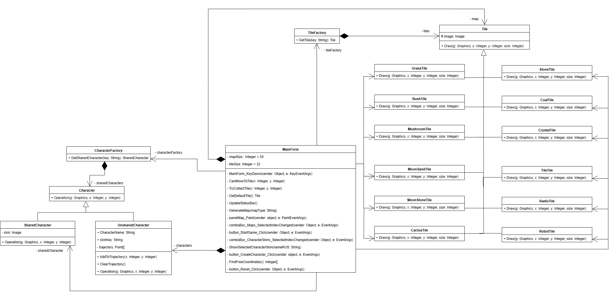
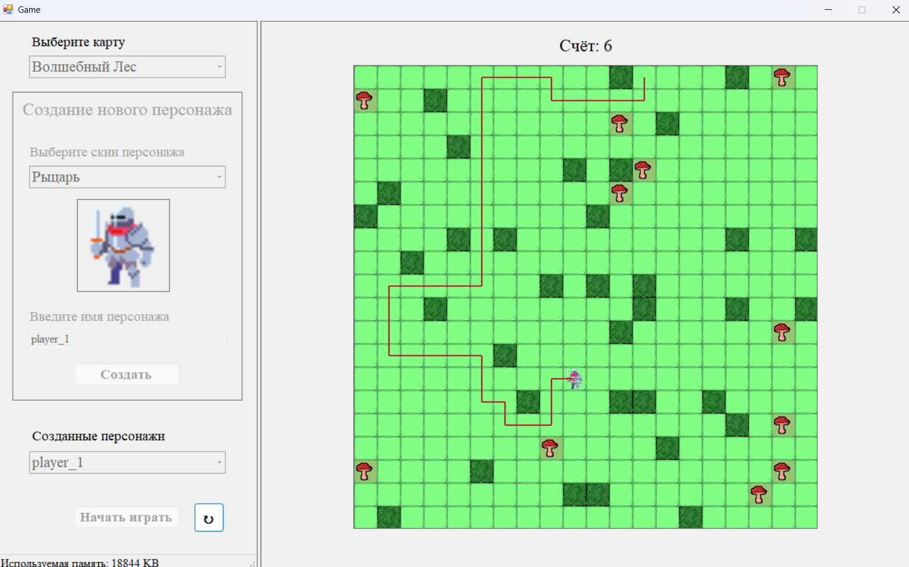

# 🎮 TileGame_FlyweightPattern

2D tile-based game demonstrating the **Flyweight** structural design pattern for memory optimization.  
2D игра с тайловой картой, демонстрирующая применение паттерна **«Приспособленец»** для оптимизации памяти.

---

## 📌 About / О проекте

🎓 Developed as part of an Object-Oriented Analysis and Design (OOAD) course.  
💡 Implements **Flyweight** to drastically reduce memory usage by reusing shared objects.  
🌍 Supports multiple map themes and unique player characters.  
🖥 Written in **C# WinForms**.

🎓 Разработано в рамках курса по ООАП.  
💡 Реализован паттерн **«Приспособленец»** для значительного снижения потребления оперативной памяти за счёт повторного использования разделяемых объектов.  
🌍 Поддержка различных типов карт и уникальных персонажей.  
🖥 Написано на **C# WinForms**.

---

## 🔧 Problem & Solution / Проблема и решение

### ❌ Initial problem / Исходная проблема
- Игровое поле формируется из множества одинаковых объектов (тайлов), каждый из которых хранил собственную текстуру.  
- Каждый персонаж создавался как уникальный объект со своим скином, даже если скин повторялся.  
- Это приводило к **избыточному потреблению памяти** и повышенной нагрузке на систему при работе с большими картами и количеством игроков.

### ✅ Applied solution / Реализованное решение
- Использован **паттерн "Приспособленец" (Flyweight)** для выделения **внутреннего состояния** (разделяемого) и **внешнего состояния** (индивидуального).  
- Созданы фабрики:
  - **TileFactory** — управляет созданием и повторным использованием текстур клеток.
  - **CharacterFactory** — управляет созданием и повторным использованием скинов персонажей.
- Внутреннее состояние (текстура или скин) хранится один раз и переиспользуется.  
- Внешнее состояние (координаты, имя персонажа, траектория движения) хранится отдельно для каждого объекта.

---

## 🎯 Features / Возможности

- 🗺 **Multiple map types** — forest, desert, cave, city  
  Несколько типов карт: лес, пустыня, пещера, город
- 🧩 **Flyweight pattern** for tiles and characters  
  Паттерн «Приспособленец» для тайлов и персонажей
- 📉 **Memory optimization** — minimizing the number of unique objects  
  Оптимизация памяти — минимизация количества уникальных объектов
- 🎨 **Reusable textures and skins** — shared objects loaded once  
  Повторное использование текстур и скинов — загрузка один раз
- 🧠 **Separated state management** — internal/external state division  
  Разделение состояния на внутреннее и внешнее
- 🚀 **Performance boost** on large maps and many players  
  Ускорение работы на больших картах и при множестве игроков
- 🖥 **WinForms-based game UI** with real-time rendering  
  Интерфейс игры на WinForms с отрисовкой в реальном времени

---

## 📁 Structure / Структура

### Tiles (Map Cells) / Тайлы (Клетки карты)
- `Tile` — abstract base class (image + Draw method)  
  Абстрактный базовый класс (текстура + метод Draw)
- Concrete tiles:  
  - Forest: `GrassTile`, `BushTile`, `MushroomTile`  
  - Desert: `MoonSandTile`, `MoonStoneTile`, `CactusTile`  
  - Cave: `StoneTile`, `CoalTile`, `CrystalTile`  
  - City: `TileTile`, `RadioTile`, `RobotTile`
- `TileFactory` — creates and reuses shared tile textures

### Characters / Персонажи
- `Character` — abstract base class (abstract `Operation`)  
  Абстрактный класс (абстрактный метод `Operation`)
- `SharedCharacter` — shared part (skin image)  
  Разделяемая часть (изображение скина)
- `UnsharedCharacter` — unique part (name, coordinates, trajectory)  
  Уникальная часть (имя, координаты, траектория)
- `CharacterFactory` — creates and reuses shared skins

### Client / Клиент
- `MainForm` — game logic, map generation, character creation  
  Логика игры, генерация карты, создание персонажей

---

## 📊 Results / Результаты

- Существенное снижение потребления памяти.
- Повышение производительности при увеличении размера карты.
- Лёгкое масштабирование для карт с большим количеством объектов.

**Example effect / Пример эффекта:**  
📈 До применения паттерна: каждое поле и каждый персонаж создавались уникально → большой расход памяти.  
📉 После применения паттерна: текстуры и скины создаются один раз и переиспользуются → экономия памяти в несколько раз.

## 🖼 Screenshots / Скриншоты

  
*Рис. 1 — Паттерн «Приспособленец» в архитектуре программы*

  
*Рис. 2 — Главное окно программы*

---
